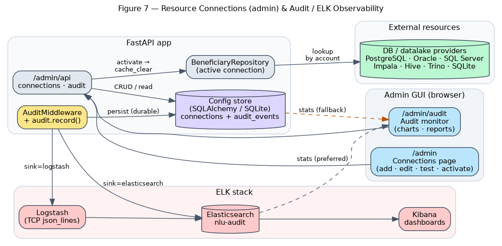

# Banking NLU Brain — How It Works & System Design (A→Z)

**Project:** `ahmed-shafie/NLP_test`
**What it is:** a bilingual (English + Arabic) Natural-Language Understanding "brain" for a
mobile-banking AI assistant, focused on the **money-transfer** journey — from a single free-text
utterance all the way to a validated, ready-to-execute transfer, including a multi-turn voice/chat
conversation, configurable beneficiary lookup, and full production operations (auth, observability,
audit/ELK).
**Audience:** engineers and reviewers integrating, operating, or extending the service.

> This document is the end-to-end ("A to Z") companion to `DESIGN.md`. `DESIGN.md` covers the NLU
> core in depth; this document covers the **whole system as it stands today**, including the security
> (P0), observability (P1), and conversation/voice (P2) layers.

---

## Table of contents

1. [Executive summary](#1-executive-summary)
2. [Capabilities at a glance](#2-capabilities-at-a-glance)
3. [High-level architecture](#3-high-level-architecture)
4. [The request lifecycle (end to end)](#4-the-request-lifecycle-end-to-end)
5. [The NLU core pipeline](#5-the-nlu-core-pipeline)
6. [Semantic vector layer (FAISS)](#6-semantic-vector-layer-faiss)
7. [LLM exception handling](#7-llm-exception-handling)
8. [Beneficiary account lookup (configurable provider)](#8-beneficiary-account-lookup-configurable-provider)
9. [Multi-turn conversation engine](#9-multi-turn-conversation-engine)
10. [Voice layer (ASR + TTS)](#10-voice-layer-asr--tts)
11. [Admin layer: connections + audit/ELK](#11-admin-layer-connections--auditelk)
12. [Security & access control](#12-security--access-control)
13. [Observability: logging, metrics, readiness, rate limiting, versioning](#13-observability)
14. [Graceful degradation](#14-graceful-degradation)
15. [API surface](#15-api-surface)
16. [Configuration reference](#16-configuration-reference)
17. [Deployment & operations](#17-deployment--operations)
18. [Project structure / module map](#18-project-structure--module-map)
19. [Testing strategy](#19-testing-strategy)
20. [Technology choices & rationale](#20-technology-choices--rationale)
21. [Roadmap / how to extend](#21-roadmap--how-to-extend)

---

## 1. Executive summary

The Banking NLU Brain converts a banking utterance — in English *or* Arabic — into a **structured,
validated intent**. v1 focuses on `transfer_money`: given `"send 500 dollars to Ahmed"` or
`"حوّل ألف جنيه إلى محمد"`, the service returns the language, the intent, the transfer slots
(`amount`, `currency`, `recipient`, `source_account`), the resolved address-book contact or
database beneficiary, and — when needed — an LLM-suggested clarification.

It is built as **independent, optional layers** so that every capability degrades cleanly:

- a deterministic **rule/NER core** (spaCy EN, Stanza AR, regex/lexicon),
- a **semantic vector layer** (multilingual embeddings + FAISS) for robust, cross-lingual matching,
- a local-**LLM safety net** (LiteLLM → Ollama) for the long tail,
- a configurable **beneficiary database lookup** (any SQL provider),
- a **multi-turn conversation engine** (slot filling, bilingual prompts, Redis/in-memory sessions),
- an optional **voice layer** (speech-to-text + text-to-speech),
- an **admin layer** (connection management GUI + audit/ELK observability),
- and a **production envelope** (API-key auth, CORS, security headers, rate limiting, structured
  logging, Prometheus metrics, readiness probe, Docker, CI).

If any model or external dependency is unavailable, the service still answers — just with reduced
sophistication. Nothing in the path hard-fails because a model failed to load or a network call timed
out.

---

## 2. Capabilities at a glance

| Capability | Module(s) | Default | Notes |
|------------|-----------|---------|-------|
| Language detection (EN/AR) | `app/nlu/lang.py` | on | Script/heuristic; caller can hint |
| Intent classification | `app/nlu/semantic_intents.py`, `intents.py` | semantic, keyword fallback | `transfer_money` vs `fallback` |
| Entity / slot extraction | `app/nlu/entities.py`, `english.py`, `arabic.py` | on | amount, currency, recipient, source; Arabic-Indic digits |
| Cross-lingual contact match | `app/nlu/contacts.py`, `app/vectorstore.py` | semantic, fuzzy fallback | `Ahmed` ↔ `أحمد حسن` |
| Beneficiary DB lookup | `app/db/beneficiary.py` | off (`NLU_DB_ENABLED`) | any SQLAlchemy provider, config-driven |
| LLM exception handler | `app/llm.py` | on (`NLU_LLM_ENABLED`) | local Ollama; gated to failures only |
| Multi-turn conversation | `app/conversation/` | on | slot-filling state machine, bilingual |
| Voice (ASR + TTS) | `app/voice/` | on (libs optional) | faster-whisper + edge-tts/pyttsx3 |
| Connection management GUI | `app/admin/connections.py` | on | switch DB providers without code |
| Audit + ELK observability | `app/admin/audit.py`, `elk.py` | on | every action; Kibana dashboards |
| API-key authentication | `app/security.py` | off (`NLU_AUTH_ENABLED`) | public + admin tiers, fail-closed |
| Structured JSON logging | `app/logging_config.py` | on | request-id correlated, ELK-ready |
| Prometheus metrics | `app/metrics.py` | on | `/metrics` |
| Readiness / liveness probes | `app/main.py` | on | `/health`, `/health/ready` |
| Rate limiting | `app/ratelimit.py` | off | per-IP fixed window |
| API versioning | `app/main.py` | on | served at `/...` and `/v1/...` |

---

## 3. High-level architecture


A single **FastAPI** app (`app/main.py`) exposes the entire HTTP surface and serves three browser
pages (the simulator at `GET /`, the connections admin at `/admin`, and the audit monitor at
`/admin/audit`). The architecture is organised in concentric responsibilities:

```
                ┌──────────────────────── FastAPI app ────────────────────────┐
   HTTP  ─────► │  Middleware stack (auth deps + cross-cutting middleware)     │
                │      ▼                                                        │
                │  Routers:  /nlu/*   /transfer/*   /contacts/*                │
                │            /conversation/*        /admin/*    /health*       │
                │      ▼                                                        │
                │  Haystack-orchestrated NLU pipeline (app/orchestration.py)   │
                │   lang → intent → entities → contact → beneficiary → LLM     │
                │      ▼                                                        │
                │  Models & stores: spaCy/Stanza · FAISS · SQLAlchemy ·        │
                │   LiteLLM/Ollama · Redis/in-mem sessions · admin config DB   │
                └─────────────────────────────────────────────────────────────┘
                                   │              │            │
                                   ▼              ▼            ▼
                              Beneficiary DB   Local LLM    Elasticsearch
                              (any provider)   (Ollama)     /Logstash/Kibana
```

**Layering principle:** each box is reached only after the one above it. The deterministic NLU core
runs first; the LLM is a *last resort*; external systems (DB, LLM, ELK, Redis) are all optional and
behind graceful-degradation guards.

---

## 4. The request lifecycle (end to end)

Every HTTP request passes through a deliberately ordered middleware stack before it reaches a route
handler. Middleware in Starlette/FastAPI is applied **outermost-first** (the last one added runs
first). The configured order, outermost → innermost (`app/main.py:68-88`):

```
client
  │
  ▼  RequestContextMiddleware   → assign/propagate X-Request-ID (ContextVar)
  ▼  CORSMiddleware             → browser origin checks (only if origins configured)
  ▼  MetricsMiddleware          → count + time the request (Prometheus)
  ▼  SecurityHeadersMiddleware  → X-Content-Type-Options, X-Frame-Options, ...
  ▼  RateLimitMiddleware        → per-IP fixed-window guard (429 if exceeded)
  ▼  BodySizeLimitMiddleware    → reject oversized bodies (413)
  ▼  AuditMiddleware            → record the final action + status (innermost)
  ▼
route handler  ──►  Depends(require_api_key | require_admin_key)  ──►  business logic
```

Why this order:

- **Request-context is outermost** so the request id is available to *everything* downstream — logs,
  the error envelope, and audit records all share it for correlation.
- **CORS and security headers wrap the guards** so even early rejections (a 429 from the rate
  limiter, a 413 from the body-size guard) still carry the right headers for a browser.
- **Audit is innermost** so it observes the *final* status code the client actually receives.

### Worked example: `POST /nlu/parse`


1. Middleware stack runs (request id assigned, metrics timer started, headers/limits checked).
2. `require_api_key` dependency authorises the call (no-op when auth is disabled).
3. `pipeline.parse(text, language, account_number)` delegates to the Haystack pipeline.
4. The pipeline runs the six NLU stages (§5), invoking FAISS, NER, the DB, and the LLM as needed.
5. The handler emits a semantic `audit.record("nlu.parse", ...)` event.
6. The response — an `NLUResponse` — flows back out through the stack, picking up the
   `X-Request-ID` and security headers, and is counted by the metrics middleware.

---

## 5. The NLU core pipeline


The pipeline is a set of Haystack 2.x `@component`s wired in sequence (`app/orchestration.py`), each
enriching a shared `state`. `app/nlu/pipeline.py:parse()` is a thin wrapper that delegates to the
orchestrated pipeline, preserving the original public API.

1. **LanguageDetector** — script/heuristic detection → `en` or `ar` (honours an optional caller
   hint).
2. **IntentClassifier** — semantic match via FAISS (`intent_source="semantic"`), falling back to the
   keyword classifier (`intent_source="keyword"`) when embeddings are unavailable. Below threshold
   the intent becomes `fallback`.
3. **EntityExtractor** — NER (spaCy EN / Stanza AR) for the recipient, plus regex/lexicon extraction
   for `amount`, `currency`, `source_account`. Handles Arabic-Indic digits (٥٠٠) and currency words.
4. **ContactResolver** — embeds the extracted recipient and matches it against the address book in
   vector space (cosine); `difflib` fuzzy matching is the fallback.
5. **BeneficiaryLookup** — when the request carries an `account_number`, resolves the destination
   beneficiary from the configured database provider (§8).
6. **LLMExceptionHandler** — fires only on deterministic failure (§7).

**Output validation.** `POST /transfer/validate` runs Pydantic validation independently:
`TransferRequest` enforces `amount > 0` and an ISO-4217 currency from `SUPPORTED_CURRENCIES`.
Failures are surfaced as `SlotError`s with human prompts (e.g. *"Who should I send the money to?"*).

---

## 6. Semantic vector layer (FAISS)


A multilingual sentence-embedding model
(`sentence-transformers/paraphrase-multilingual-MiniLM-L12-v2`) maps EN and AR text into the **same**
vector space, so paraphrases and cross-script names land near each other.

- **Intent classification** — labeled example utterances (`app/nlu/examples.py`) are embedded and
  stored in a FAISS `IndexFlatIP` over L2-normalized vectors (inner product = cosine). A query is
  embedded, the top-`k` (`semantic_top_k=5`) neighbours are retrieved, scores are aggregated per
  intent, and the best clears `semantic_intent_threshold` (0.45) to win.
- **Contact matching** — `DEMO_CONTACTS` (names in both scripts) are embedded and indexed; an
  extracted recipient is matched to the nearest contact above `contact_match_threshold` (0.5).

The adversarial proof that embeddings (not string matching) are at work: a **Latin** query `Ahmed`
resolves to the **Arabic** contact `أحمد حسن`.

---

## 7. LLM exception handling

The LLM is a **safety net, not the main path**. It runs only when the deterministic result is
incomplete — decided by `_needs_llm(state)` in `app/llm.py`:

```python
def _needs_llm(state) -> bool:
    if not settings.llm_enabled:           # globally disabled
        return False
    if state.intent == Intent.FALLBACK:    # rules couldn't classify
        return True
    if state.intent == Intent.TRANSFER_MONEY:
        e = state.entities                 # transfer missing a critical slot
        return e.amount is None or not e.recipient
    return False
```

When triggered, the handler sends a **strict-JSON** prompt to a local model via **LiteLLM**
(`ollama/qwen2.5:3b`, offline, no API key) asking for `intent`, `amount`, `currency`, `recipient`,
`source_account`, and a `clarification`. The result is **merged without overwriting** any value the
rules already produced, and `llm_assisted=true` is set. A short reachability probe guards the call:
if the server is down or `NLU_LLM_ENABLED=false`, the node is skipped and the output is identical to
the pure-rules path.

This resolves the known limitation that the spelled-out Arabic amount `"ألف"` (one thousand) is not
parsed by the regex extractor — the LLM recovers it as `1000`. The same handler also exposes
`respond_unresolved(...)`, used by the beneficiary flow (§8) to reply in the user's language when an
account number is not found.

---

## 8. Beneficiary account lookup (configurable provider)


When a request includes an `account_number`, the **destination beneficiary** is resolved by a SQL
lookup *before* the response is built. The provider is **fully configuration-driven** — switch
between PostgreSQL, Oracle, SQL Server, Impala, Hive, SQLite, etc. **without code changes**:

- `NLU_DB_URL` — SQLAlchemy URL selects the dialect/driver (the provider).
- `NLU_DB_QUERY` — the parameterized lookup SQL (one bind param, `:account_number` by default).
- `NLU_DB_COLUMN_MAP` — JSON mapping result columns → `Beneficiary` fields.

`BeneficiaryRepository` (`app/db/beneficiary.py`) wraps a single SQLAlchemy `Engine`, built once via
an `lru_cache`d factory. Drivers are optional installs; only the one in use is required.

```text
no account_number          → skip DB; name-based contact match only
account found              → resolved_beneficiary set; beneficiary_source="database";
                             fills the recipient (and currency) slot
account not found / DB down → beneficiary_unresolved=True → delegate to LiteLLM:
                             respond_unresolved() generates a reply;
                             beneficiary_source="llm", clarification set
```

Every failure path degrades gracefully (missing driver, unreachable DB, failing query → `None`,
logged, never raised). The provider can be chosen by env vars *or* through the admin connections GUI
(§11), in which case the active stored connection takes precedence.

---

## 9. Multi-turn conversation engine

The conversation engine (`app/conversation/`) drives a transfer to confirmation over several turns —
asking only for what is missing, in the user's language. It is a small **slot-filling state machine**
persisted per session.

### State machine

```
                       ┌─────────────┐
        new utterance  │  COLLECTING │◄────────────┐ (missing a required slot:
   ───────────────────►│             │             │  amount / currency / recipient)
                       └──────┬──────┘─────────────┘
                              │ all required slots filled
                              ▼
                       ┌─────────────┐  "yes"/نعم ───► ┌────────────┐
                       │ CONFIRMING  │────────────────►│ COMPLETED  │ (TransferRequest ready)
                       │             │  "no"/cancel ──► └────────────┘
                       └──────┬──────┘
                              │ "cancel"/إلغاء (from any state)
                              ▼
                       ┌─────────────┐
                       │  CANCELLED  │
                       └─────────────┘
```

Key behaviours (`app/conversation/engine.py`):

- **Slots are merged across turns, never overwritten.** If `amount` is already filled and the user
  later says "500", it is ignored — the engine only fills empty slots.
- **Pending-slot interpretation.** When the engine just asked for a specific slot (e.g. recipient),
  a bare answer like "Ahmed" is interpreted as that slot's value even if the parser didn't tag it.
- **Confirmation gate.** Once all required slots are present, the engine summarises the transfer and
  asks for confirmation. Affirm/negate vocabularies are bilingual (`yes/نعم/تمام`, `no/لا/إلغاء`).
- **Validation on completion.** On "yes" it runs the same Pydantic `validate_transfer`; if that
  fails (e.g. unsupported currency) it re-collects the offending slot rather than erroring.
- **New dialogue after completion.** A fresh utterance after a finished/cancelled dialogue resets
  state and starts a new transfer.

### Sessions

`ConversationState` (`state.py`) is a Pydantic model (session id, language, intent, status, slots,
pending slot, turn count) serialized to/from the session store. The store (`store.py`) is:

- **`RedisSessionStore`** — shared across instances, with a per-session TTL (`NLU_SESSION_TTL_SECONDS`,
  default 1800s). Selected by `NLU_SESSION_BACKEND=redis`.
- **`InMemorySessionStore`** — process-local fallback. Used by default, and **automatically** when
  Redis is configured but unreachable (the factory pings Redis on startup and falls back on failure).

Endpoint: `POST /conversation/text` with `{text, session_id?, language?}` returns the reply, status,
language, intent, pending slot, the accumulated slots, and the final `transfer` when complete.

---

## 10. Voice layer (ASR + TTS)

The optional voice layer (`app/voice/`) lets a client speak a turn and hear the reply. The endpoint
`POST /conversation/voice` accepts an uploaded audio clip (multipart), transcribes it, runs the same
conversation engine, and returns the text reply plus synthesized audio (base64).

```
audio upload ─► ASR (faster-whisper) ─► transcript ─► ConversationEngine.handle()
                                                              │
                                          reply text ◄────────┘
                                                              │
                              TTS (edge-tts / pyttsx3) ─► audio_base64 + mime
```

- **ASR** (`asr.py`) uses **faster-whisper**, lazily loaded and cached. `transcribe()` returns `None`
  on any failure; `asr_available()` gates the endpoint (returns **503** when speech recognition is
  unavailable). Model/device/compute-type are configurable (`NLU_WHISPER_*`).
- **TTS** (`tts.py`) prefers **edge-tts** (`NLU_TTS_ENGINE=edge-tts`, neural voices per language),
  falling back to **pyttsx3** for fully offline synthesis. `synthesize()` returns `None` when no
  engine is available — the voice response then simply omits the audio rather than failing.

The whole layer is optional: the libraries are not hard dependencies, and when they (or their models)
are missing the text conversation continues to work normally.

---

## 11. Admin layer: connections + audit/ELK



Two operational concerns are managed from a small admin layer (`app/admin/`) with browser GUIs.

**External resource connections (`/admin`).** Database *and* datalake providers (PostgreSQL, Oracle,
SQL Server, MySQL, Impala, Hive, Trino, Presto, SQLite) are managed through a browser page and
persisted in a local SQLAlchemy **config store** (`NLU_ADMIN_STORE_URL`, SQLite by default). Each
connection holds the SQLAlchemy URL, lookup query, account bind-parameter, and column map. The page
supports **add / edit / delete**, **test connection**, and **activate**. The beneficiary repository
resolves config in this order:

```text
active stored connection (if NLU_USE_STORED_CONNECTION) → NLU_DB_* env settings → disabled
```

Activating clears the cached repository so the next lookup rebuilds against the new provider — still
no code changes to switch providers.

**Audit log + ELK (`/admin/audit`).** `AuditMiddleware` records **every HTTP request** (method,
path, status, latency, client IP, actor, request id, outcome); domain code adds semantic events via
`audit.record(...)` (`nlu.parse`, `connection.test`, `connection.activate`, …). Each event is:

1. **persisted** durably to the config store (`audit_events` table), and
2. **shipped** to ELK via `NLU_AUDIT_SINK`: `elasticsearch` (direct), `logstash` (TCP JSON lines),
   or `none`. Shipping can run on a **background worker thread** (`NLU_AUDIT_ASYNC=true`) so slow
   network I/O never blocks the request path.

The dashboard renders charts/reports (actions over time, status split, by category, top actions,
avg/p95 latency, recent events). Stats come from **Elasticsearch aggregations** when reachable and
**fall back to store aggregations** otherwise, so observability never goes dark. The same data powers
a provisioned **Kibana** dashboard (`deploy/elk/`). All auditing is wrapped in try/except — a failing
store write or unreachable ELK never breaks the request path.

---

## 12. Security & access control

Authentication is **API-key based**, with two tiers, implemented as FastAPI dependencies
(`app/security.py`):

| Tier | Header | Guards | Setting |
|------|--------|--------|---------|
| Public | `X-API-Key` | `/nlu/*`, `/transfer/*`, `/contacts/*`, `/conversation/*` | `NLU_API_KEYS` |
| Admin | `X-Admin-Key` | `/admin/api/*` | `NLU_ADMIN_API_KEYS` |

Design points:

- **Opt-in, off by default** (`NLU_AUTH_ENABLED=false`) so local development is frictionless. Turn it
  **on** in any shared/prod deployment.
- **Fail-closed.** If auth is enabled but no keys are configured, requests return **503** rather than
  silently allowing access.
- **Constant-time comparison** (`secrets.compare_digest`) to avoid timing attacks; multiple keys are
  supported (comma-separated) for rotation.
- **Separate admin keys** keep the connection-management surface (which can create DB connection
  strings) isolated from the public NLU surface.

Complementary hardening (all in the middleware stack, §4):

- **Security headers** — `X-Content-Type-Options: nosniff`, `X-Frame-Options: DENY`,
  `Referrer-Policy: no-referrer`, `X-XSS-Protection: 0`.
- **CORS** — locked down by default (no origins); set `NLU_CORS_ALLOW_ORIGINS` explicitly in prod.
- **Body-size limit** — requests above `NLU_MAX_REQUEST_BYTES` (1 MB default) are rejected with 413.
- **Uniform error envelope** — every error is `{"error": {"code", "message", "request_id"}}`
  (`app/errors.py`), so clients get a consistent, correlatable shape.

---

## 13. Observability

The service is built to be operated, not just run.

- **Structured JSON logging** (`app/logging_config.py`). A `JsonFormatter` emits one JSON object per
  log line (`timestamp`, `level`, `logger`, `message`, and the current `request_id`), ready for ELK
  ingestion. Noisy third-party loggers (haystack, httpx, elastic-transport, …) are pinned to WARNING.
  Toggle with `NLU_LOG_JSON` / `NLU_LOG_LEVEL`.
- **Request-id correlation** (`app/request_context.py`). A `ContextVar` carries an
  `X-Request-ID` (inbound header reused, or generated) across logs, the error envelope, and audit
  events, and is echoed back in the response header.
- **Prometheus metrics** (`app/metrics.py`) at `GET /metrics`:
  `nlu_http_requests_total{method,path,status}` and
  `nlu_http_request_duration_seconds{method,path}`.
- **Health probes** (`app/main.py`):
  - `GET /health` — **liveness** (process is up): `{status, version}`.
  - `GET /health/ready` — **readiness**: checks the config/audit store (gating) and reports the
    embedder; returns **200** when ready, **503** otherwise. Ideal for Kubernetes readiness gates.
- **Rate limiting** (`app/ratelimit.py`) — opt-in (`NLU_RATE_LIMIT_ENABLED`), per-IP fixed window
  (`NLU_RATE_LIMIT_PER_MINUTE`, default 120) on the public NLU paths; exceeded requests get a 429 in
  the uniform error envelope.
- **API versioning** — public routers are served at both the unversioned paths (back-compat) and
  under a canonical `/v1` prefix, so clients can pin a version.

---

## 14. Graceful degradation


Each capability is optional and downgrades cleanly:

| Layer | Preferred | Fallback | Signal |
|-------|-----------|----------|--------|
| Intent | semantic (FAISS) | keyword rules | `intent_source` |
| Entities | spaCy/Stanza NER | regex/lexicon | — |
| Contact | FAISS cosine | `difflib` fuzzy | `resolved_recipient.score` |
| Beneficiary | DB provider (SQLAlchemy) | LiteLLM responder | `beneficiary_source` |
| Exception | LiteLLM/Ollama | skipped | `llm_assisted` |
| Connection | active stored connection | `NLU_DB_*` env settings | `/admin` active badge |
| Conversation sessions | Redis | in-memory | automatic on Redis failure |
| Voice ASR | faster-whisper | 503 (endpoint) | `asr_available()` |
| Voice TTS | edge-tts | pyttsx3 → omit audio | `audio_base64` present? |
| Audit stats | Elasticsearch aggregations | local store aggregations | `AuditStats.source` |
| Audit ship | ELK (ES/Logstash) | local store only | `ElkStatus.reachable` |

---

## 15. API surface

| Method & path | Auth | Purpose |
|---------------|------|---------|
| `POST /nlu/parse` | public | Parse an utterance (optional `account_number`) → intent + slots + beneficiary |
| `POST /transfer/validate` | public | Validate gathered slots → errors or a ready transfer |
| `GET /nlu/similar?text=&k=` | public | Nearest labeled examples (semantic debug/eval) |
| `POST /contacts/resolve` | public | Resolve a name cross-lingual |
| `POST /conversation/text` | public | Advance a multi-turn dialogue with one text message |
| `POST /conversation/voice` | public | Transcribe audio → advance dialogue → synthesize reply |
| `GET /health` | none | Liveness `{status, version}` |
| `GET /health/ready` | none | Readiness (store/embedder checks) |
| `GET /metrics` | none | Prometheus exposition |
| `GET /` · `/admin` · `/admin/audit` | none (pages) | Browser UIs (simulator, connections, audit) |
| `GET/POST /admin/api/connections` (+ `/{id}`, `/{id}/activate`, `/{id}/test`, `/test`, `/providers`, `/active`) | admin | Manage external resource connections |
| `GET /admin/api/audit/events` · `/stats` · `/elk-status` | admin | Audit events, dashboard aggregations, ELK health |

All public endpoints are also available under `/v1/...`. Schemas live in `app/schemas.py` (NLU),
`app/conversation/schemas.py` (conversation/voice), and `app/admin/schemas.py` (admin). OpenAPI docs
are served at `/docs`.

---

## 16. Configuration reference

All settings are environment-overridable with the `NLU_` prefix (`app/config.py`).

### Core NLU

| Variable | Default | Meaning |
|----------|---------|---------|
| `NLU_PRELOAD_MODELS` | `false` | Warm models at startup vs. lazily |
| `NLU_EMBEDDING_MODEL` | `…/paraphrase-multilingual-MiniLM-L12-v2` | Sentence-embedding model |
| `NLU_USE_SEMANTIC_INTENT` | `true` | Use FAISS intent classifier (else keyword) |
| `NLU_SEMANTIC_TOP_K` | `5` | Neighbours considered per query |
| `NLU_SEMANTIC_INTENT_THRESHOLD` | `0.45` | Cosine floor for semantic intent |
| `NLU_CONTACT_MATCH_THRESHOLD` | `0.5` | Cosine floor for contact match |

### LLM exception handler

| Variable | Default | Meaning |
|----------|---------|---------|
| `NLU_LLM_ENABLED` | `true` | Enable the LLM exception handler |
| `NLU_LLM_MODEL` | `ollama/qwen2.5:3b` | LiteLLM model string |
| `NLU_LLM_API_BASE` | `http://localhost:11434` | Local LLM server |
| `NLU_LLM_TIMEOUT` / `NLU_LLM_TEMPERATURE` | `30.0` / `0.0` | Call timeout / sampling temperature |

### Beneficiary DB

| Variable | Default | Meaning |
|----------|---------|---------|
| `NLU_DB_ENABLED` | `false` | Enable beneficiary account lookup |
| `NLU_DB_URL` | `None` | SQLAlchemy URL (selects the provider) |
| `NLU_DB_QUERY` | `SELECT … WHERE account = :account_number` | Parameterized lookup |
| `NLU_DB_ACCOUNT_PARAM` | `account_number` | Bind-param name |
| `NLU_DB_COLUMN_MAP` | `{}` | JSON: result columns → `Beneficiary` fields |
| `NLU_USE_STORED_CONNECTION` | `true` | Prefer the active stored connection over `NLU_DB_*` |
| `NLU_ADMIN_STORE_URL` | `sqlite:///./app_config.db` | Connections + audit store |

### Security

| Variable | Default | Meaning |
|----------|---------|---------|
| `NLU_AUTH_ENABLED` | `false` | Require API keys |
| `NLU_API_KEYS` / `NLU_ADMIN_API_KEYS` | `""` | Public / admin keys (comma-separated) |
| `NLU_CORS_ALLOW_ORIGINS` | `""` | Allowed CORS origins |
| `NLU_MAX_REQUEST_BYTES` | `1000000` | Max body size (413 above) |

### Observability

| Variable | Default | Meaning |
|----------|---------|---------|
| `NLU_LOG_LEVEL` / `NLU_LOG_JSON` | `INFO` / `true` | Log level / JSON logging |
| `NLU_METRICS_ENABLED` | `true` | Expose `/metrics` |
| `NLU_RATE_LIMIT_ENABLED` / `NLU_RATE_LIMIT_PER_MINUTE` | `false` / `120` | Rate limiting |

### Audit / ELK

| Variable | Default | Meaning |
|----------|---------|---------|
| `NLU_AUDIT_ENABLED` | `true` | Record audit events |
| `NLU_AUDIT_SINK` | `elasticsearch` | `elasticsearch` / `logstash` / `none` |
| `NLU_AUDIT_ASYNC` | `true` | Ship on a background worker thread |
| `NLU_ELK_ENABLED` | `true` | Ship to / aggregate from Elasticsearch |
| `NLU_ELASTICSEARCH_URL` | `http://localhost:9200` | Elasticsearch endpoint |
| `NLU_ELK_INDEX` | `nlu-audit` | Audit index |
| `NLU_LOGSTASH_HOST` / `NLU_LOGSTASH_PORT` | `localhost` / `50000` | Logstash TCP (json_lines) |

### Conversation / Voice

| Variable | Default | Meaning |
|----------|---------|---------|
| `NLU_CONVERSATION_ENABLED` | `true` | Enable the conversation endpoints |
| `NLU_SESSION_BACKEND` | `memory` | `redis` or `memory` (auto-fallback) |
| `NLU_REDIS_URL` | `redis://localhost:6379/0` | Redis URL |
| `NLU_SESSION_TTL_SECONDS` | `1800` | Session TTL |
| `NLU_VOICE_ENABLED` | `true` | Enable the voice endpoint |
| `NLU_WHISPER_MODEL` / `NLU_WHISPER_DEVICE` / `NLU_WHISPER_COMPUTE_TYPE` | `small` / `cpu` / `int8` | ASR config |
| `NLU_TTS_ENGINE` | `edge-tts` | `edge-tts` or `pyttsx3` |
| `NLU_TTS_VOICE_EN` / `NLU_TTS_VOICE_AR` | `en-US-AriaNeural` / `ar-EG-SalmaNeural` | TTS voices |

See `.env.example` for a copy-pasteable template.

---

## 17. Deployment & operations

**Container.** The `Dockerfile` builds a slim image that runs as a **non-root** user and declares a
healthcheck against `/health`. Compose files start the app and (optionally) the ELK stack.

**Local run:**
```bash
pip install -r requirements.txt
uvicorn app.main:app --reload --port 8000
# open http://localhost:8000/        (simulator)
#      http://localhost:8000/docs    (OpenAPI)
#      http://localhost:8000/admin   (connections)
```

**ELK stack:** `deploy/elk/` provides a docker-compose for Elasticsearch + Logstash + Kibana, an
index template, provisioning, and a Kibana dashboard.

**CI** (`.github/workflows/ci.yml`) runs on every push/PR:

1. `ruff check` + `ruff format --check` (lint & format)
2. `mypy` (static types)
3. `pytest` (unit/integration suite)
4. `pip-audit` (dependency vulnerability scan)

**Production checklist:** set `NLU_AUTH_ENABLED=true` with real keys; set `NLU_CORS_ALLOW_ORIGINS`;
point `NLU_DB_*` (or an admin connection) at the real beneficiary store; point `NLU_ELASTICSEARCH_URL`
/ Logstash at the real ELK; consider `NLU_SESSION_BACKEND=redis` for multi-instance deployments;
enable `NLU_RATE_LIMIT_ENABLED`; scrape `/metrics`; wire `/health` (liveness) and `/health/ready`
(readiness) into the orchestrator.

---

## 18. Project structure / module map

```
app/
  main.py                 # FastAPI app, middleware wiring, routers, health/metrics
  config.py               # Settings (NLU_ prefix) + currencies + demo contacts
  schemas.py              # NLU Pydantic models (TransferRequest, NLUResponse, ...)
  errors.py               # Uniform error envelope + exception handlers
  security.py             # API-key auth dependencies (public + admin)
  middleware.py           # Security headers + body-size limit
  request_context.py      # Request-id ContextVar middleware
  logging_config.py       # Structured JSON logging
  metrics.py              # Prometheus metrics + middleware
  ratelimit.py            # Per-IP fixed-window rate limiter
  orchestration.py        # Haystack pipeline wiring
  llm.py                  # LiteLLM exception handler (local Ollama)
  embeddings.py           # Sentence-embedding model loader
  vectorstore.py          # FAISS index helpers
  nlu/
    lang.py · intents.py · semantic_intents.py
    entities.py · english.py · arabic.py
    contacts.py · examples.py · pipeline.py
  db/
    beneficiary.py        # Configurable SQLAlchemy beneficiary lookup
  conversation/
    state.py · store.py · templates.py · engine.py · schemas.py · router.py
  voice/
    asr.py · tts.py
  admin/
    store.py · connections.py · audit.py · elk.py · schemas.py · router.py
  static/                 # Browser UIs (index.html, connections.html, audit.html)
deploy/elk/               # ELK docker-compose, index template, Kibana dashboard
docs/                     # DESIGN.md, ARCHITECTURE.md (this), figures/
tests/                    # pytest suite
```

---

## 19. Testing strategy

- **Unit/integration:** `pytest`. `tests/conftest.py` disables the live LLM for determinism;
  semantic tests auto-skip if the embedder is unavailable; LLM tests mock the handler (no running
  Ollama needed). Coverage spans the NLU core, beneficiary repository (in-memory SQLite, hit/miss,
  custom column maps, failing-query degradation), admin connection CRUD/test/activate, audit
  recording + ES→store stats fallback, the security/observability envelope, and the conversation
  engine + session store + voice endpoint degradation.
- **Static analysis:** `ruff check` + `ruff format`; `mypy`.
- **Security:** `pip-audit` in CI.
- **Live verification (web simulator):** Arabic word-amount recovered to `1000` (LLM-assisted),
  fallback clarification rendered, a complete English transfer resolved by rules with **no** LLM
  badge, a beneficiary resolved from the database by account number, and an unknown account delegated
  to the LLM for a bilingual reply — proving the LLM is gated to failures only.

---

## 20. Technology choices & rationale

| Decision | Why |
|----------|-----|
| **FastAPI + Pydantic** | Async HTTP with typed validation; one schema layer for I/O and business rules. |
| **spaCy (EN) / Stanza (AR)** | Mature NER per language; Stanza has strong Arabic support. |
| **FAISS (in-process)** | No external service/credentials; fast cosine search over a small labeled set. |
| **Multilingual MiniLM** | One model embeds EN+AR into a single space → cross-lingual matching for free; CPU-friendly. |
| **Haystack 2.x** | Componentized, inspectable orchestration; easy to add/remove stages. |
| **LiteLLM** | Uniform interface to any LLM; swap local↔hosted by changing one model string. |
| **Local Ollama `qwen2.5:3b`** | Offline, no API key, good Arabic; meets the "local LLM only" requirement. |
| **SQLAlchemy (beneficiary + config store)** | One Core API spans many providers; switch via the URL with no code changes. |
| **Redis sessions (optional)** | Shared multi-instance state with TTL; in-memory fallback keeps single-node simple. |
| **faster-whisper / edge-tts** | Strong multilingual ASR and natural TTS; both optional and lazily loaded. |
| **ELK + Kibana** | Industry-standard log analytics; decoupled via a sink setting with a local-store fallback. |
| **Prometheus** | De-facto metrics standard; trivial to scrape `/metrics`. |

---

## 21. Roadmap / how to extend

- **More intents** (`check_balance`, `transaction_history`, `pay_bill`): add labeled examples to
  `app/nlu/examples.py`, extend the `Intent` enum and validators, and (if needed) a new component in
  the pipeline. The semantic classifier picks up new examples automatically.
- **More languages:** add a detector branch and an NER backend; the multilingual embeddings already
  generalise, so intent/contact matching needs no change.
- **Hosted LLM:** change `NLU_LLM_MODEL` (and provider credentials) — LiteLLM handles the rest.
- **New DB provider:** install its driver and set `NLU_DB_URL` (or add a connection in `/admin`).
- **P3 hardening (planned):** pre-commit hooks, a coverage threshold gate, Trivy image scanning,
  Sentry error tracking, encryption of stored connection secrets, and DB connection-pool tuning.

---

### Appendix — Figure sources

All figures are generated from Graphviz DOT sources in `docs/figures/*.dot`:

```bash
cd docs/figures
for f in fig1_architecture fig2_pipeline fig3_sequence fig4_vector \
         fig5_degradation fig6_beneficiary fig7_admin_elk; do
  dot -Tpng -Gdpi=140 "$f.dot" -o "$f.png"
done
```
