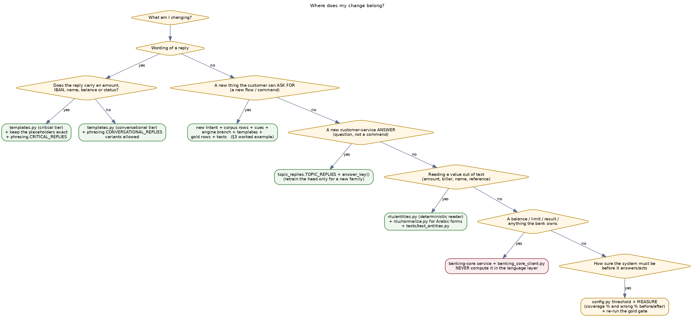

# Making Changes Yourself — a hands-on guide

Repository: <https://github.com/ahmed-shafie/NLP_test> · `main` @ `a9d8fa0`
Companion documents: [`SYSTEM_ARCHITECTURE.md`](SYSTEM_ARCHITECTURE.md) (what the system is) and
[`DEVELOPER_GUIDE.md`](DEVELOPER_GUIDE.md) (setup, conventions, reference tables).
This document is the one you keep open **while** editing: where a change belongs, two complete
worked examples with real code, the checklist that must pass, and the mistakes that will cost you a
day if nobody warns you.

---

## 0. The 10-minute loop

```bash
cd NLP_test && source .venv/bin/activate

# 1. branch
git checkout main && git pull && git checkout -b feat/last-transactions

# 2. edit …

# 3. fast feedback: only the tests near your change (seconds, no models loaded)
pytest tests/test_conversation.py -q -x

# 4. see it as the customer does
uvicorn app.main:app --reload --port 8001      # open http://localhost:8001/assistant?dev=1

# 5. full gate before you push (a few minutes)
ruff format app banking-core tests && ruff check app banking-core tests \
  && mypy app banking-core && pytest -q && python scripts/eval_nlu.py

# 6. push + PR
git add <the files you touched> && git commit -m "feat(conversation): …" && git push -u origin HEAD
```

Never `git add .` — the repo sits next to model caches, demo databases and a built index.

---

## 1. Where does my change belong?



The one question that decides everything: **is the thing I am adding a value the bank owns, or a
sentence the assistant says?** Bank-owned values (balance, limit, fee, result, IBAN validity) come
from Banking Core, always. Sentences live in `templates.py` / `topic_replies.py`. Nothing may cross
that line, and no model may write either one.

---

## 2. Worked example A — add a customer-service answer (30 minutes)

**Goal**: when a customer asks about *replacing a lost card*, answer instead of showing the menu.

### A.1 Add the reply — `app/conversation/topic_replies.py`

```python
TOPIC_REPLIES: dict[str, dict[Language, str]] = {
    # … existing entries …
    "lost_card_replacement": {
        Language.EN: (
            "If your card is lost, freeze it from Cards → Freeze first, then request a "
            "replacement from the same screen. I can't order the replacement for you here."
        ),
        Language.AR: (
            "لو البطاقة ضايعة، اقفلها أول من البطاقات ← إيقاف مؤقت، وبعدها اطلب بديلة من "
            "نفس الشاشة. ما أقدر أطلب البديلة من هنا."
        ),
    },
}
```

Two rules this reply obeys, and yours must too:

1. **No invented fact.** No fee, no "3–5 working days", no card number — you are not the bank.
   If the customer needs a number, the reply must point them to where the bank shows it.
2. **It states what the assistant cannot do.** That is why `topic_answer` is a *critical* reply key
   (`app/conversation/phrasing.py`): a re-worded capability claim would become a false promise, so the
   text is never rephrased by a model.

### A.2 Point the corpus topics at it — `answer_key()`

The retrieval index is labelled with raw ArBanking77 topics; `answer_key()` maps a topic to the reply
family it deserves:

```python
def answer_key(topic: str) -> str:
    if topic in {"lost_or_stolen_card", "card_lost"}:
        return "lost_card_replacement"
    ...
```

Sharing one reply between several topics is *desirable*: a customer who reads a correct, slightly
broader answer is never misled, while a narrow-but-wrong answer is a defect.

### A.3 Test it

```python
# tests/test_topic_replies.py
def test_lost_card_question_is_answered_in_both_languages() -> None:
    for text in ("i lost my card", "ضيعت بطاقتي"):
        result = engine.handle(ConversationRequest(text=text, user_id="demo"))
        assert "Freeze" in result.reply or "إيقاف" in result.reply
        assert result.intent is not Intent.TRANSFER_MONEY   # a question never opens a flow
```

That second assertion is the important one. Every new answer widens what the assistant is willing to
respond to; the gate that protects you is *"a question must not start a money flow"* — and the gold
eval enforces it globally (`wrong_flow_starts` must stay 0).

### A.4 Does the trained head need retraining?

- Added a topic that maps to an **existing** family → no. The head already predicts that class.
- Added a **new** family (as above) → the head's 28 classes don't include it, so only retrieval can
  select it. Retrain when you want head coverage:

```bash
python -m scripts.train_topic_classifier      # rewrites app/nlu/data/topic_head.npz (~1.6 MB)
```

Then re-measure answered % / wrong % on the held-out slices before shipping — a bigger head that
answers more *and* errs more is a regression, not a win.

---

## 3. Worked example B — add a whole feature end-to-end

**Goal**: *"show me my last transactions" / "آخر عمليات في حسابي"* → the assistant lists the last few
transactions. This is a **new flow**, needs **bank-owned data**, and returns **amounts** — so it
touches every layer, which is exactly why it makes a good example.

> The code below is illustrative (this feature is not in `main`); the shapes, names and file paths
> match the real code so you can copy them.

### B.1 Decide the contract first

| Question | Answer | Why |
|---|---|---|
| Who owns the data? | Banking Core | it is the financial source of truth |
| Any slots to collect? | none required (optional account type) | keep flows minimal |
| Is the reply critical? | **yes** — it prints amounts and dates | must be a fixed template |
| Failure behaviour? | `status = FAILED` + "couldn't fetch" reply | never invent an empty statement |

### B.2 Banking Core: the endpoint that owns the truth

```python
# banking-core/banking_core/schemas.py
class TransactionsRequest(BaseModel):
    owner_user: str
    account_type: str | None = None
    limit: int = Field(default=5, ge=1, le=20)

class TransactionOut(BaseModel):
    date: date
    description: str
    amount: Decimal
    currency: str
    direction: Literal["debit", "credit"]

class TransactionsResult(BaseModel):
    account_type: str
    transactions: list[TransactionOut]
```

```python
# banking-core/banking_core/main.py
@app.post("/accounts/transactions", response_model=TransactionsResult)
def accounts_transactions(
    req: TransactionsRequest, _: None = Depends(require_api_key)
) -> TransactionsResult:
    return service.last_transactions(req)
```

Follow the existing endpoints exactly: API-key dependency, typed request/response, and the SQL in
`service.py` / `db.py` (a `transactions` table alongside `accounts`, `beneficiaries`, `billers`).
CI runs the suite against **both SQLite and Postgres**, so avoid SQLite-only SQL (booleans, `LIMIT`
quirks, date functions).

### B.3 The client — `app/banking_core_client.py`

```python
def get_transactions(
    owner_user: str, account_type: str | None = None, limit: int = 5
) -> TransactionsInfo | None:
    """Return the last transactions, or ``None`` when the Core cannot answer.

    ``None`` is a refusal, never an empty statement: an empty list means "no
    transactions", which is a different fact.
    """
```

Return `None` on timeout/error and let the caller degrade. Never fabricate a default.

### B.4 Recognise the request — cues before the classifier

Deterministic cues are what make a common phrasing reliable; the classifier is the safety net, not the
primary path. Copy the balance pattern in `app/conversation/engine.py`:

```python
_STATEMENT_CUES = {
    normalize(w)
    for w in ("transactions", "statement", "عمليات", "حركات", "كشف")
}
_STATEMENT_PHRASES = tuple(
    normalize(p)
    for p in ("last transactions", "recent activity", "آخر العمليات", "كشف حساب")
)


def _is_statement_request(text: str) -> bool:
    norm = normalize(text)
    return bool(_STATEMENT_CUES & set(norm.split())) or any(
        p in norm for p in _STATEMENT_PHRASES
    )
```

Then add the intent and route it:

```python
# app/schemas.py
class Intent(str, Enum):
    ...
    TRANSACTION_HISTORY = "transaction_history"
```

```python
# app/conversation/engine.py — inside route_fresh_turn / decide_action, BEFORE the
# generous transfer/bill cues, exactly like the balance branch:
if _is_statement_request(text):
    return Intent.TRANSACTION_HISTORY
```

**Order matters.** The recipient and biller extractors are deliberately generous (a 20k-name
gazetteer, "mobile" → STC), so a new read-only intent must be tested *before* them, or
`عمليات حسابي` can be read as a name and open a transfer.

### B.5 Teach the index — `app/nlu/data/example_corpus.jsonl`

```json
{"text": "show me my last transactions", "intent": "transaction_history", "topic": "", "language": "en", "dialect": "english", "source": "manual"}
{"text": "ابغى اشوف آخر العمليات في حسابي", "intent": "transaction_history", "topic": "", "language": "ar", "dialect": "saudi", "source": "manual"}
```

Write **Saudi** phrasings, not MSA textbook sentences — the customers are Saudi and the measured Arabic
weakness is coverage of real dialect wording. Add ~10–20 rows per language, varied in verb and word
order, and never copy a row from the held-out test splits (that would inflate every later measurement).

### B.6 The reply — a critical template

```python
# app/conversation/templates.py
def transactions_reply(
    account_type: str, lines: list[str], language: Language
) -> str:
    body = "\n".join(lines)
    if language is Language.AR:
        label = _ACCOUNT_TYPE_AR.get(account_type, account_type)
        return f"آخر العمليات في حساب {label}:\n{body}"
    return f"Your latest {account_type} account activity:\n{body}"
```

```python
# app/conversation/phrasing.py
CRITICAL_REPLIES = frozenset({..., "transactions_reply"})
```

Every figure in `lines` must be rendered by the engine's existing `self._fmt_amount(...)` from Core
values. Do not format money with an f-string of your own, and do not add an emoji-laden "summary"
sentence that restates the numbers — a second rendering is a second chance to be wrong.

### B.7 The handler — `app/conversation/engine.py`

Model it on `_handle_balance_inquiry`:

```python
def _handle_transaction_history(
    self, state: ConversationState, text: str, lang: Language
) -> ConversationResult:
    """List recent transactions using the external Banking Core API."""

    info = banking_core_client.get_transactions(
        owner_user=self._owner(state), account_type=_account_type(text)
    )
    state.intent = Intent.TRANSACTION_HISTORY
    state.status = ConversationStatus.COMPLETED
    if info is None:
        state.status = ConversationStatus.FAILED          # refusal, not an empty list
        return self._finish(state, templates.transactions_unavailable(lang))
    lines = [
        templates.transaction_line(
            t.date, t.description, self._fmt_amount(t.amount), t.currency, t.direction, lang
        )
        for t in info.transactions
    ]
    return self._finish(state, templates.transactions_reply(info.account_type, lines, lang))
```

Wrap the dispatch in a trace span so the stage shows up in `block_trace`:

```python
with tracer.span("transaction_history") as span:
    span.annotate("statement_cue")
    return self._handle_transaction_history(state, text, lang)
```

### B.8 Tests — write these three, minimum

```python
def test_statement_request_lists_transactions(fake_core) -> None:      # happy path, both languages
def test_core_failure_reports_failed_not_empty(fake_core) -> None:     # status is FAILED
def test_statement_question_does_not_open_a_transfer() -> None:        # the safety assertion
```

Plus gold rows in `app/eval/nlu_gold.jsonl`:

```json
{"text": "show me my last transactions", "language": "en", "intent": "transaction_history", "slots": {}}
{"text": "ابغى اشوف آخر العمليات", "language": "ar", "intent": "transaction_history", "slots": {}}
```

If you add gold rows for a new intent, also give it a floor in `MIN_INTENT_RECALL`
(`app/eval/harness.py`) — otherwise nothing stops a later change from silently breaking your feature.

### B.9 Ship it

```bash
ruff format app banking-core tests && ruff check app banking-core tests
mypy app banking-core
pytest -q
python scripts/eval_nlu.py            # must end with GATE PASSED
```

PR description must contain: what the customer can now do, **which layer owns each value**, the new
gold rows, and — if you touched any threshold or the head — a before/after table of answered % and
wrong %.

---

## 4. Worked example C — change existing behaviour (a threshold)

Say Arabic service questions feel under-answered and you want to lower `topic_head_threshold`.

1. **Never** edit the default and call it done. First measure the current state on the held-out
   slices (answered %, wrong %) — that is your baseline.
2. Change it **by environment variable**, not in code, for the experiment:
   ```bash
   NLU_TOPIC_HEAD_THRESHOLD=0.99 python your_measure_script.py
   ```
3. Report both directions. Example of the real trade-off already measured here: 0.999 → 0.99 buys
   roughly +9 points of Arabic coverage for about **3× the wrong-answer rate**. That is why the shipped
   value is 0.999.
4. Re-run `python scripts/eval_nlu.py`. A gate change can turn a question into a money flow; the gold
   set is what catches it.
5. Only then change the default in `app/config.py`, and put the table in the PR.

The same discipline applies to `name_match_score` / `name_match_margin` (identity!),
`semantic_route_threshold`, and `topic_reply_*`.

---

## 5. Pre-push checklist

- [ ] Does any reply I added or edited contain a number, name or IBAN? → critical tier, template, no variation.
- [ ] Did I compute a financial value in Python instead of asking Banking Core? → move it.
- [ ] Does a Core failure end as `FAILED` (not `completed`, not a silent default)?
- [ ] Can my new cue/intent be triggered by an unrelated question? → add the negative test.
- [ ] Does an ambiguous identity still *ask* instead of picking? → never auto-pick.
- [ ] New reply key classified in `CRITICAL_REPLIES` or `CONVERSATIONAL_REPLIES`?
- [ ] Arabic covered as well as English (cues, templates, corpus rows, tests)?
- [ ] Gold rows added; `python scripts/eval_nlu.py` prints **GATE PASSED**.
- [ ] `ruff format` + `ruff check` + `mypy` clean; `pytest -q` green.
- [ ] Did I add a second `encode()` of the same text? → reuse the vector (that is the whole latency budget).
- [ ] Nothing committed that isn't source: no `.venv`, `*.db`, `.env`, caches, built index, screenshots.
- [ ] PR: one concern, before/after numbers for anything measurable.

---

## 6. Mistakes that will cost you a day

| What you'll see | Cause | Fix |
|---|---|---|
| `ValidationError: score Input should be less than or equal to 1 … 1.0000001192092896` | FAISS cosine overshoots by float error | clamp: `min(max(hit.score, 0.0), 1.0)` |
| your Arabic cue never matches | the text is normalised (ال / proclitics / ٠-٩ / أ إ آ / ة) stripped first | store the **normalised bare** form: `ايجار`, not `الايجار` |
| a test asserts wording and fails randomly | reply variation | the suite pins `reply_variation_enabled=false`; assert the *first* phrasing (see `tests/conftest.py`) |
| a test needs the LLM and gets nothing | `conftest.py` disables the live LLM | install a fake handler via monkeypatch |
| your new intent works, two old tests break | generous extractors now see your phrasing | order your cue check before the transfer/bill cues, and keep both tests |
| eval prints `wrong_flow_starts 3 > 0` | new corpus rows moved the routing boundary | reduce/relabel rows; do not raise the limit |
| coverage jumps beautifully after retraining | you indexed the measurement split | the corpus builder drops the dialect test splits — keep it that way |
| first request hangs ~45 s | lazy model load | `NLU_PRELOAD_MODELS=true` |
| multi-turn state resets every message | in-memory sessions with >1 worker | `NLU_SESSION_BACKEND=redis` |
| balance replies "couldn't fetch" | stale `banking-core` container image | rebuild it, or run the Core from source |
| `mypy` complains about a missing attribute | you guessed a type | read the model in `schemas.py`; do **not** reach for `Any`/`getattr` |

---

## 7. Debugging your own change

```bash
curl -s localhost:8001/conversation/text -H 'content-type: application/json' \
  -d '{"text":"ابغى اشوف آخر العمليات","user_id":"demo"}' | python -m json.tool
```

Read `block_trace` top to bottom: which stage ran, how long it took, and what it decided (`note`).
In the browser, `/assistant?dev=1` shows the same trace in the Inspect panel next to the reply — it is
the fastest way to answer "why did it do that?" without adding print statements.

Three questions and their stage:

- *Wrong flow opened?* → `intent_classification` note + your cue order in `decide_action`.
- *Question not answered?* → `topic_answer` note tells you which of the three gate conditions failed
  (probability < 0.999, retrieved score < 0.80, or the majority disagreed).
- *Wrong person?* → `contact_resolution` (score and the 5-point margin) then `beneficiary_lookup`.

---

## 8. If you are unsure, choose the safe failure

The system is allowed to be *unhelpful*; it is not allowed to be *wrong about money*. When in doubt:
ask a clarifying question, refuse politely, or show the menu — never guess an identity, never round an
amount, never assume a write succeeded. Every gate in this repo exists because that trade was made
deliberately, and a PR that widens coverage without reporting its error rate will be sent back.
