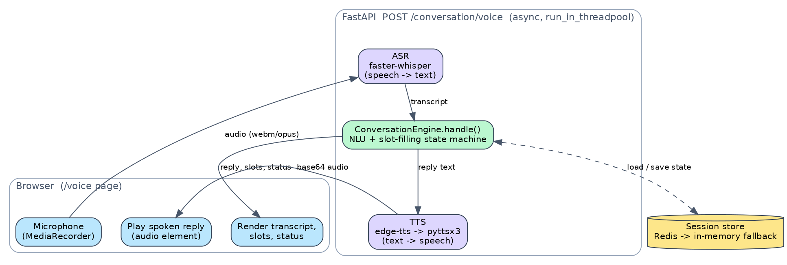

# Conversation & Voice — How It Works

This document explains how the **multi-turn conversation engine** and the **voice
layer** (live microphone in the browser → speech recognition → dialogue → spoken
reply) work in the Banking NLU Brain.

It complements the full system design in [`ARCHITECTURE.md`](./ARCHITECTURE.md)
and the NLU-core deep dive in [`DESIGN.md`](./DESIGN.md). Here we focus only on
the conversational and voice subsystem added in PR #5.

---

## 1. The big picture

There are two ways to talk to the assistant, and they share the **same brain**:

| Channel | Endpoint | Input | Output |
|---|---|---|---|
| Text | `POST /conversation/text` | a text message | a text reply + dialogue state |
| Voice | `POST /conversation/voice` | an audio clip | transcript + text reply + **spoken reply audio** |

The voice channel is just the text channel with **speech-to-text (ASR)** bolted
on the front and **text-to-speech (TTS)** bolted on the back. The dialogue logic
in the middle is identical, so everything you can do by typing you can also do by
speaking, and you can mix the two within a single conversation.



*Figure — a single voice turn: the browser records audio and uploads it; the API
transcribes it, runs the dialogue engine (loading/saving session state), and
returns the reply text plus synthesized audio, which the browser plays.*

---

## 2. The dialogue: a slot-filling state machine

A money transfer needs three **required slots**: `amount`, `currency`, and
`recipient` (plus optional `source_account`, `account_number`, `note`). The
engine collects them over as many turns as it takes, then asks for confirmation
before completing.

```
            ┌──────────────┐   missing a required slot
            │  COLLECTING  │◀───────────────────────────┐
            └──────┬───────┘                             │
   all required    │                                     │ invalid slot
   slots filled    ▼                                     │ (e.g. bad currency)
            ┌──────────────┐    "no" / "cancel"   ┌──────┴───────┐
            │  CONFIRMING  │─────────────────────▶│  CANCELLED   │
            └──────┬───────┘                      └──────────────┘
        "yes" /    │
        confirm    ▼
            ┌──────────────┐
            │  COMPLETED   │  → returns a validated TransferRequest
            └──────────────┘
```

- **COLLECTING** — on each turn the engine runs the normal NLU pipeline on the
  message, extracts any slots it can, and merges them into the session (it
  **never overwrites** an already-filled slot). It then asks for the *first*
  still-missing required slot and records that as the `pending_slot`.
- **CONFIRMING** — once all three required slots are present, the engine echoes a
  confirmation prompt ("Please confirm: transfer 500 USD to Ahmed. (yes/no)").
- **COMPLETED** — on an affirmative it validates the slots through
  `pipeline.validate_transfer`. If validation rejects a slot (e.g. an unsupported
  currency) it drops back to **COLLECTING** to re-ask just that slot; otherwise it
  returns a validated `TransferRequest`.
- **CANCELLED** — any "cancel" (or "no" at confirmation) ends the dialogue.

### Two conveniences that make it feel natural

1. **Bare-answer interpretation.** If the engine just asked "Who should I send it
   to?" (so `pending_slot == "recipient"`) and the user replies simply "Ahmed",
   that bare answer is assigned to the pending slot even though "Ahmed" on its own
   isn't a full transfer sentence.
2. **Bilingual intent words.** Affirm / negate / cancel are recognized in both
   English and Arabic (e.g. `yes / نعم / تمام`, `no / لا`, `cancel / إلغاء`), and
   prompts are rendered in the conversation's detected language.

### Code shape (`app/conversation/engine.py`)

```python
def handle(self, message, session_id, language=None) -> ConversationResult:
    state = self.store.load(session_id) or ConversationState.new(session_id)

    if _is_cancel(message):                      # → CANCELLED
        ...
    if state.status is CONFIRMING:
        if _is_affirm(message):  return self._complete(state)   # validate → COMPLETED
        if _is_negate(message):  return self._cancel(state)

    parsed = pipeline.parse(message)             # reuse the NLU brain
    state.merge_slots(parsed.entities)           # fill empty slots only
    if state.pending_slot and _looks_like_bare_answer(message):
        state.set_slot(state.pending_slot, message)

    missing = state.first_missing_required_slot()
    state.status = COLLECTING if missing else CONFIRMING
    state.pending_slot = missing
    self.store.save(state)                        # persist for the next turn
    return ConversationResult(state, reply=self._render(state), ...)
```

---

## 3. A text turn, step by step

`POST /conversation/text` with `{ "text": "...", "session_id": "...", "language": null }`:

1. Guard: if the conversation engine is disabled (`NLU_CONVERSATION_ENABLED=false`)
   → `503`.
2. Load the session state by `session_id` (omit it on the first turn — the engine
   mints a new id and returns it).
3. Run `ConversationEngine.handle()` (the state machine above).
4. Persist the updated state and return:

```json
{
  "session_id": "d193175c…",
  "reply": "Please confirm: transfer 500 USD to Ahmed. Shall I proceed? (yes/no)",
  "status": "confirming",
  "language": "en",
  "intent": "transfer_money",
  "pending_slot": null,
  "complete": false,
  "slots": { "amount": "500", "currency": "USD", "recipient": "Ahmed", … },
  "transfer": null
}
```

When `status` becomes `completed`, `complete` is `true` and `transfer` holds the
validated transfer object.

**Example (three turns, one session):**

```bash
# turn 1 — no session_id yet
curl -s localhost:8000/conversation/text -H 'content-type: application/json' \
  -d '{"text":"I want to send money"}'
# → reply "How much would you like to transfer?", status collecting, returns session_id

# turn 2 — reuse the session_id
curl -s localhost:8000/conversation/text -H 'content-type: application/json' \
  -d '{"text":"500 USD to Ahmed","session_id":"<id>"}'
# → "Please confirm: transfer 500 USD to Ahmed. (yes/no)", status confirming

# turn 3
curl -s localhost:8000/conversation/text -H 'content-type: application/json' \
  -d '{"text":"yes","session_id":"<id>"}'
# → "Done — your transfer of 500 USD to Ahmed is ready.", status completed
```

---

## 4. A voice turn, step by step

`POST /conversation/voice` is a multipart upload: `audio` (the clip) plus optional
`session_id` and `language` form fields. The handler is **async**, and it offloads
the heavy/blocking work to a worker thread:

```python
@router.post("/conversation/voice")
async def conversation_voice(audio: UploadFile = File(...), session_id=Form(None), language=Form(None)):
    _require_conversation()
    if not asr.asr_available():
        raise HTTPException(503, "Speech recognition is unavailable …")

    data = await audio.read()
    # write to a temp file, then transcribe in a worker thread
    transcript = await run_in_threadpool(asr.transcribe, tmp_path, language)
    if not transcript:
        raise HTTPException(422, "Could not transcribe the supplied audio.")

    result = await run_in_threadpool(get_engine().handle, transcript, session_id, language)
    synth  = await run_in_threadpool(tts.synthesize, result.reply, result.state.language)

    return VoiceResponse(**_to_response(result).model_dump(),
                         transcript=transcript,
                         audio_base64=b64(synth[0]) if synth else None,
                         audio_mime=synth[1]       if synth else None)
```

The response is the same dialogue payload as the text endpoint, **plus**:
`transcript` (what the ASR heard) and `audio_base64` / `audio_mime` (the spoken
reply, base64-encoded so it travels in JSON).

### Why `run_in_threadpool` matters (a real bug this fixed)

`edge-tts` synthesizes by running its own asyncio event loop via
`asyncio.run(...)`. Calling that *inside* an already-running `async` request loop
raises `RuntimeError: asyncio.run() cannot be called from a running event loop`
— which silently returned **no audio**. Running ASR / engine / TTS through
`run_in_threadpool` executes them in worker threads that have no running loop, so
`asyncio.run()` works *and* the request loop isn't blocked by CPU/network work.

> Compatibility note: `edge-tts` must be `>= 7.2.8`. Older releases return HTTP
> `403` because Microsoft changed the `Sec-MS-GEC` auth token used by the service.

---

## 5. The live voice web page (`GET /voice`)

`app/static/voice.html` is a self-contained page (no build step) that turns a
real microphone into a conversation:

1. **Record** — clicking the mic calls `navigator.mediaDevices.getUserMedia({audio:true})`
   and starts a `MediaRecorder` (WebM/Opus). Clicking again stops it.
2. **Upload** — the recorded `Blob` is sent to `/conversation/voice` as multipart,
   along with the current `session_id` (kept in a JS variable across turns) and the
   selected language.
3. **Render** — the transcript is shown as a "user" bubble, the reply as an
   "assistant" bubble, and the three required slots + status badge update.
4. **Speak** — `audio_base64` is decoded to a `Blob` and auto-played.

There is also a text box on the same page that posts to `/conversation/text`, so
you can type or speak interchangeably within one session. The page degrades
clearly: if the mic permission is denied or `getUserMedia` fails, it shows an
inline error; if the server can't transcribe, you get a `422`/`503` surfaced in
the UI.

To run it:

```bash
pip install -r requirements.txt -r requirements-voice.txt
uvicorn app.main:app --port 8000
# open http://localhost:8000/voice  (allow microphone access; use http://localhost)
```

---

## 6. Sessions & persistence (`app/conversation/store.py`)

State lives behind a small `SessionStore` protocol (`load`, `save`, `delete`):

- **`InMemorySessionStore`** — process-local, thread-safe; perfect for a single
  instance / local dev.
- **`RedisSessionStore`** — shared across instances, with a TTL so abandoned
  conversations expire.

Selection is config-driven and **fails soft**: with `NLU_SESSION_BACKEND=redis`
the app tries Redis at `NLU_REDIS_URL`, and if the `redis` package is missing or
the server is unreachable it automatically falls back to the in-memory store
(logging a warning) rather than crashing.

---

## 7. The voice layer is optional (graceful degradation)

`app/voice/asr.py` and `app/voice/tts.py` import their heavy dependencies
**lazily**, so the core install stays lean and the app runs fine without them:

| Situation | Behavior |
|---|---|
| `faster-whisper` missing / model can't load | `/conversation/voice` returns `503`; text dialogue unaffected |
| No TTS engine available | You still get `transcript` + text `reply`, just no `audio_base64` |
| `edge-tts` fails | Falls back to `pyttsx3` (offline) |
| Conversation disabled | Both endpoints return `503` |

The heavy deps live in a separate `requirements-voice.txt`
(`faster-whisper`, `edge-tts`, `pyttsx3`).

---

## 8. Configuration reference

All variables use the `NLU_` prefix.

| Variable | Default | Purpose |
|---|---|---|
| `NLU_CONVERSATION_ENABLED` | `true` | Master switch for both conversation endpoints |
| `NLU_SESSION_BACKEND` | `memory` | `memory` or `redis` |
| `NLU_REDIS_URL` | `redis://localhost:6379/0` | Redis connection (when backend is `redis`) |
| `NLU_SESSION_TTL_SECONDS` | `1800` | Expiry for stored conversations |
| `NLU_VOICE_ENABLED` | `true` | Master switch for ASR/TTS |
| `NLU_WHISPER_MODEL` | `small` | faster-whisper model size (`tiny`…`large-v3`) |
| `NLU_WHISPER_DEVICE` | `cpu` | `cpu` or `cuda` |
| `NLU_WHISPER_COMPUTE_TYPE` | `int8` | Quantization (e.g. `int8`, `float16`) |
| `NLU_TTS_VOICE_EN` | `en-US-AriaNeural` | edge-tts English voice |
| `NLU_TTS_VOICE_AR` | `ar-EG-SalmaNeural` | edge-tts Arabic voice |

(If API-key auth is enabled via `NLU_AUTH_ENABLED=true`, both endpoints require the
`X-API-Key` header — they are guarded by `require_api_key`.)

---

## 9. Where the code lives

```
app/conversation/
  engine.py      # the state machine + slot merging (the "brain" of the dialogue)
  state.py       # ConversationState / ConversationSlots (serializable)
  store.py       # InMemory + Redis session stores (auto-fallback)
  templates.py   # bilingual EN/AR prompts
  router.py      # POST /conversation/text and /conversation/voice
  schemas.py     # request/response models
app/voice/
  asr.py         # faster-whisper speech-to-text (lazy import, returns None if unavailable)
  tts.py         # edge-tts → pyttsx3 text-to-speech (lazy import)
app/static/
  voice.html     # the live microphone web page (GET /voice)
```

Tests covering all of the above are in `tests/test_conversation.py` (progressive
slot filling, confirm/cancel, Arabic dialogue, session isolation & persistence,
bare-answer fill, re-collect on invalid currency, the endpoints, the `/v1` alias,
disabled→503, voice degradation, and the voice happy-path round-trip).
