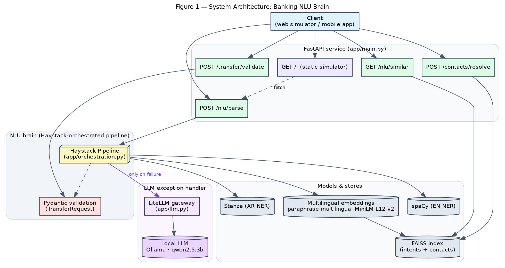
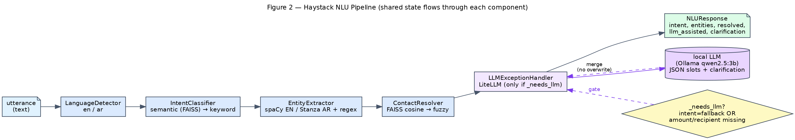
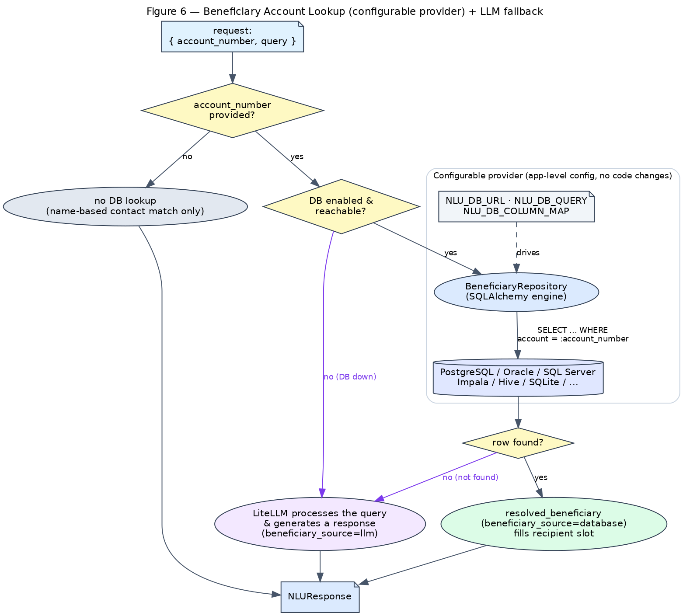
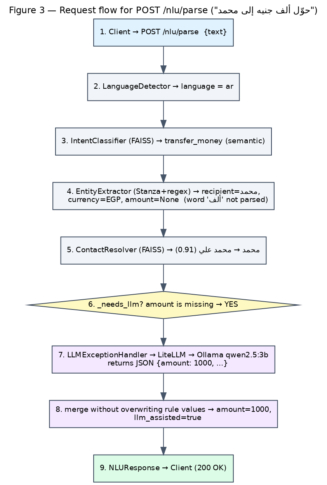
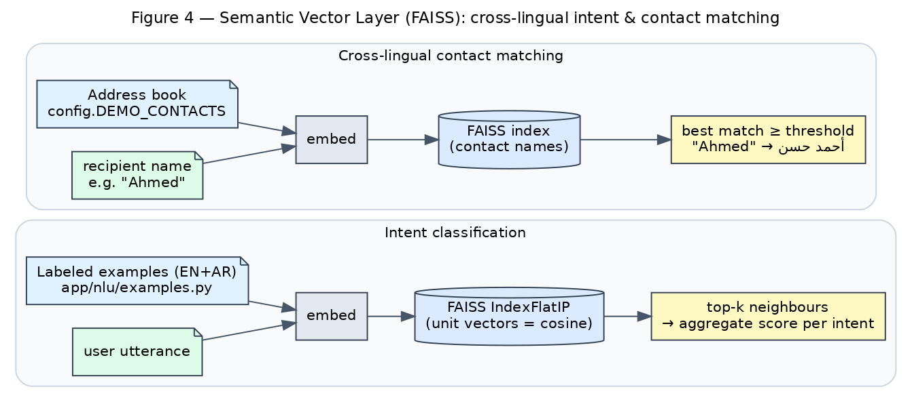
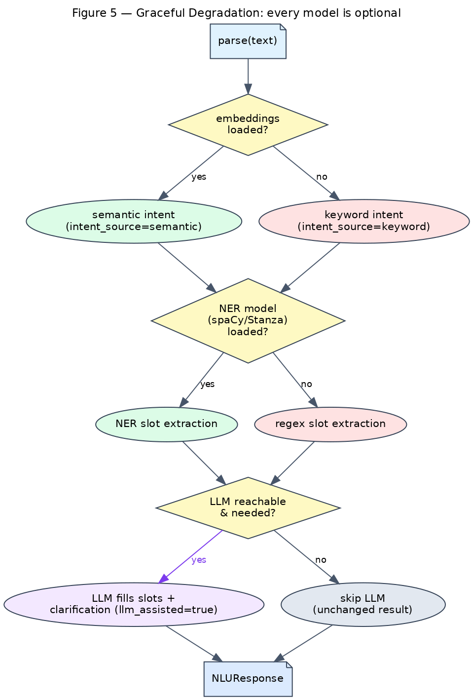

# Banking NLU Brain — Design Document

**Project:** `ahmed-shafie/NLP_test` · **Scope:** bilingual (English + Arabic) money-transfer NLU for a mobile-banking assistant
**Status:** implemented on PR #1 · **Audience:** engineers / reviewers integrating or extending the service

---

## 1. Overview

The Banking NLU Brain turns a free-text banking utterance — in English *or* Arabic — into a
structured, validated intent. v1 focuses on the **`transfer_money`** intent: given something like
`"send 500 dollars to Ahmed"` or `"حوّل ألف جنيه إلى محمد"`, it returns the intent, the language,
the transfer slots (`amount`, `currency`, `recipient`, `source_account`), the resolved address-book
contact, and — when needed — an LLM-suggested clarification.

The system is deliberately layered so each capability is **independent and optional**: a deterministic
rule/NER core, a semantic vector layer for robustness, and a local-LLM safety net for the hard cases.
If any model is unavailable the service still answers, just with reduced sophistication
(see §7, Figure 5).

### Design goals
| Goal | How it is met |
|------|---------------|
| Bilingual EN/AR | spaCy (EN) + Stanza (AR); multilingual embeddings share one vector space |
| Robust intent detection | Semantic FAISS classifier with a keyword fallback |
| Cross-lingual recipients | Embed the address book so `Ahmed` ↔ `أحمد حسن` |
| Strict, safe output | Pydantic `TransferRequest` validation (amount > 0, known currency) |
| Handle the long tail | Local LLM (LiteLLM → Ollama) recovers missing slots / clarifies |
| Run offline, no keys | Local Ollama model `qwen2.5:3b`; everything else runs in-process |
| Never hard-fail | Graceful degradation at every layer |

---

## 2. System Architecture



A single **FastAPI** app (`app/main.py`) exposes the HTTP surface and serves a browser simulator at
`GET /`. Requests to `POST /nlu/parse` run through the **Haystack-orchestrated pipeline**
(`app/orchestration.py`), which calls the NLP models and stores. `POST /transfer/validate` runs the
**Pydantic** validation independently. The **LLM exception handler** (`app/llm.py`) sits at the end of
the pipeline and is only invoked on deterministic failure.

### Components
- **FastAPI service** — routing, request/response schemas, lifespan model warm-up.
- **Haystack pipeline** — orchestrates the five NLU stages as connected components.
- **spaCy / Stanza** — named-entity recognition for recipient names (EN / AR).
- **Embeddings + FAISS** — `paraphrase-multilingual-MiniLM-L12-v2` vectors indexed for semantic intent
  classification and cross-lingual contact matching.
- **Beneficiary DB (SQLAlchemy)** — configurable account-number lookup against any SQL provider; see §4b.
- **LiteLLM + Ollama** — uniform LLM gateway to a local model for exception handling.
- **Pydantic** — strict validation that converts slots into a ready transfer or actionable prompts.

---

## 3. NLU Pipeline (Haystack orchestration)



The pipeline is five Haystack `@component`s wired in sequence, each enriching a shared `state` dict:

1. **LanguageDetector** — script/heuristic detection → `en` or `ar` (honours an optional caller hint).
2. **IntentClassifier** — semantic match via FAISS (`intent_source = "semantic"`); falls back to the
   keyword classifier (`intent_source = "keyword"`) if embeddings are unavailable. Below
   `intent_threshold` / `semantic_intent_threshold` the intent becomes `fallback`.
3. **EntityExtractor** — NER (spaCy EN / Stanza AR) for the recipient plus regex/lexicon extraction for
   `amount`, `currency`, `source_account`; handles Arabic-Indic digits (٥٠٠) and currency words.
4. **ContactResolver** — embeds the extracted recipient and matches it against the address book in
   vector space (cosine); `difflib` fuzzy matching is the fallback.
5. **BeneficiaryLookup** — when the request carries an `account_number`, resolves the destination
   beneficiary from the configured database provider — see §4b.
6. **LLMExceptionHandler** — see §4.

`app/nlu/pipeline.py:parse()` is now a thin wrapper that delegates to `orchestration.run_pipeline()`,
preserving the original public API.

---

## 4. LLM Exception Handling

The LLM is a **safety net, not the main path**. It runs only when the deterministic result is
incomplete — decided by `_needs_llm(state)`:

```python
def _needs_llm(state) -> bool:
    if not settings.llm_enabled:           # globally disabled
        return False
    if state.intent == Intent.FALLBACK:    # rules couldn't classify
        return True
    if state.intent == Intent.TRANSFER_MONEY:
        e = state.entities                 # transfer missing a critical slot
        return e.amount is None or not e.recipient
    return False
```

When triggered, `LLMExceptionHandler` (`app/llm.py`) sends a strict-JSON prompt to a local model via
**LiteLLM** (`ollama/qwen2.5:3b`) asking for `intent`, `amount`, `currency`, `recipient`,
`source_account`, and a `clarification`. The result is **merged without overwriting** any value the
rules already produced, and `llm_assisted=true` is set. A 2-second reachability probe guards the call:
if the server is down or `NLU_LLM_ENABLED=false`, the node is skipped and the output is identical to
the pure-rules path.

This resolves the known limitation that the spelled-out Arabic amount `"ألف"` (one thousand) is not
parsed by the regex extractor — the LLM recovers it as `1000`.

The same handler also exposes `respond_unresolved(...)`, used by the beneficiary flow (§4b): a
plain-text prompt that asks the model to reply (in the user's language) when an account number is not
found in the database.

---

## 4b. Beneficiary Account Lookup (configurable provider)



When a request includes an `account_number`, the **destination beneficiary** is resolved by a SQL
lookup *before* the response is built. The provider is **fully configuration-driven** so it can switch
between PostgreSQL, Oracle, SQL Server, Impala, Hive, SQLite, etc. **without code changes**:

- `NLU_DB_URL` — SQLAlchemy URL selects the dialect/driver (the provider).
- `NLU_DB_QUERY` — the parameterized lookup SQL (one bind param, `:account_number` by default).
- `NLU_DB_COLUMN_MAP` — JSON mapping of result columns → `Beneficiary` fields (`id`, `name`, `account`,
  `bank`, `branch`, `currency`), so any schema works.

`BeneficiaryRepository` (`app/db/beneficiary.py`) wraps a single SQLAlchemy `Engine` and is built once
via an `lru_cache`d factory. The DB drivers are optional installs (`psycopg`, `oracledb`, `pyodbc`,
`impyla`, `pyhive`, …) — only the one in use is required.

Decision logic (`BeneficiaryLookup` component):

```text
no account_number          → skip DB; name-based contact match only
account found              → resolved_beneficiary set; beneficiary_source="database";
                             fills the recipient (and currency) slot
account not found / DB down → beneficiary_unresolved=True → delegate to LiteLLM:
                             respond_unresolved() generates a reply;
                             beneficiary_source="llm", clarification set
```

Every failure path degrades gracefully: a missing driver, an unreachable database, or a failing query
returns `None` (logged, never raised), and the request falls through to the LLM responder. If the LLM
is also unavailable, the response simply reports no beneficiary.

### Request flow example



---

## 5. Semantic Vector Layer (FAISS)



A multilingual sentence-embedding model maps EN and AR text into the **same** vector space, so
paraphrases and cross-script names land near each other.

- **Intent classification** — labeled example utterances (`app/nlu/examples.py`) are embedded and stored
  in a FAISS `IndexFlatIP` over L2-normalized vectors (inner product = cosine). A query utterance is
  embedded, the top-`k` (`semantic_top_k=5`) neighbours are retrieved, and scores are aggregated per
  intent; the best intent wins if it clears `semantic_intent_threshold` (0.45).
- **Contact matching** — `config.DEMO_CONTACTS` (names stored in both scripts) are embedded and indexed.
  An extracted recipient is matched to the nearest contact above `contact_match_threshold` (0.5).

The adversarial proof that embeddings (not string matching) are at work: a **Latin** query `Ahmed`
resolves to the **Arabic** contact `أحمد حسن`.

---

## 6. API Surface

| Method & path | Purpose | Key response fields |
|---------------|---------|---------------------|
| `POST /nlu/parse` | Parse an utterance (optional `account_number`) | `language`, `intent`, `intent_source`, `confidence`, `entities`, `resolved_recipient`, `resolved_beneficiary`, `beneficiary_source`, `llm_assisted`, `clarification` |
| `GET /nlu/similar?text=&k=` | Nearest labeled examples (debug) | list of `{text, intent, score}` (descending) |
| `POST /contacts/resolve` | Resolve a name cross-lingual | `matched`, `candidates[]` |
| `POST /transfer/validate` | Validate gathered slots | `valid`, `transfer`, `missing[]`, `errors[]` |
| `GET /health` | Liveness | `{status, version}` |
| `GET /` | Browser simulator | HTML |

Schemas live in `app/schemas.py`. `TransferRequest` enforces `amount > 0` and an ISO-4217 currency from
`SUPPORTED_CURRENCIES`; failures are surfaced as `SlotError`s with human prompts (e.g. "Who should I
send the money to?").

---

## 7. Graceful Degradation



Each model is optional and the pipeline downgrades cleanly:

| Layer | Preferred | Fallback | Signal |
|-------|-----------|----------|--------|
| Intent | semantic (FAISS) | keyword rules | `intent_source` |
| Entities | spaCy/Stanza NER | regex/lexicon | — |
| Contact | FAISS cosine | `difflib` fuzzy | `resolved_recipient.score` |
| Beneficiary | DB provider (SQLAlchemy) | LiteLLM responder | `beneficiary_source` |
| Exception | LiteLLM/Ollama | skipped | `llm_assisted` |

Set `NLU_LLM_ENABLED=false` to disable the LLM entirely; the spelled-out Arabic amount then stays
`null` (expected), and no errors occur.

---

## 8. Configuration

All settings are environment-overridable with the `NLU_` prefix (`app/config.py`):

| Variable | Default | Meaning |
|----------|---------|---------|
| `NLU_PRELOAD_MODELS` | `false` | Warm models at startup vs. lazily |
| `NLU_EMBEDDING_MODEL` | `…/paraphrase-multilingual-MiniLM-L12-v2` | Sentence-embedding model |
| `NLU_SEMANTIC_INTENT_THRESHOLD` | `0.45` | Cosine floor for semantic intent |
| `NLU_CONTACT_MATCH_THRESHOLD` | `0.5` | Cosine floor for contact match |
| `NLU_LLM_ENABLED` | `true` | Enable the LLM exception handler |
| `NLU_LLM_MODEL` | `ollama/qwen2.5:3b` | LiteLLM model string |
| `NLU_LLM_API_BASE` | `http://localhost:11434` | Local LLM server |
| `NLU_DB_ENABLED` | `false` | Enable beneficiary account lookup |
| `NLU_DB_URL` | `None` | SQLAlchemy URL (selects the provider) |
| `NLU_DB_QUERY` | `SELECT ... WHERE account = :account_number` | Parameterized lookup query |
| `NLU_DB_ACCOUNT_PARAM` | `account_number` | Bind-param name in the query |
| `NLU_DB_COLUMN_MAP` | `{}` | JSON: result columns → `Beneficiary` fields |

---

## 9. Technology Choices & Rationale

| Decision | Why |
|----------|-----|
| **FastAPI + Pydantic** | Async HTTP with first-class typed validation; one schema layer for I/O and business rules. |
| **spaCy (EN) / Stanza (AR)** | Mature NER for each language; Stanza has strong Arabic support. |
| **FAISS (in-process)** | No external service or credentials; fast cosine search for a small labeled set. |
| **Multilingual MiniLM** | Single model embeds EN+AR into one space → cross-lingual matching for free; CPU-friendly (~470 MB). |
| **Haystack 2.x** | Componentized, inspectable orchestration; easy to insert/remove stages (e.g. the LLM node). |
| **LiteLLM** | Uniform interface to any LLM provider; swap local↔hosted by changing one model string. |
| **Local Ollama `qwen2.5:3b`** | Offline, no API key, good Arabic; meets the "local LLM only" requirement. |
| **SQLAlchemy (beneficiary DB)** | One Core API spans PostgreSQL, Oracle, SQL Server, Impala, Hive, SQLite, …; switch providers via the URL with no code changes. Drivers are optional installs. |

---

## 10. Testing

- **Unit/integration:** `pytest` (70 tests). `tests/conftest.py` disables the live LLM for determinism;
  semantic tests auto-skip if the embedder is unavailable. `tests/test_orchestration.py` and
  `tests/test_llm.py` mock the LLM handler (no running Ollama needed). `tests/test_beneficiary.py`
  exercises the repository against an in-memory SQLite database (lookup hit/miss, custom column
  mapping, and failing-query degradation).
- **Static analysis:** `ruff check` + `ruff format`; `mypy` on the new modules.
- **Live verification** (web simulator): Arabic word-amount recovered to `1000` (LLM assisted), fallback
  clarification rendered, a complete English transfer resolved by rules with **no** LLM badge, a
  beneficiary resolved from the database by account number, and an unknown account delegated to the
  LLM for a bilingual reply — proving the LLM is gated to failures only.

---

## Appendix — Figure source

All figures are generated from Graphviz DOT sources in `docs/figures/*.dot`:

```bash
cd docs/figures
for f in fig1_architecture fig2_pipeline fig3_sequence fig4_vector fig5_degradation fig6_beneficiary; do
  dot -Tpng -Gdpi=140 "$f.dot" -o "$f.png"
done
```
